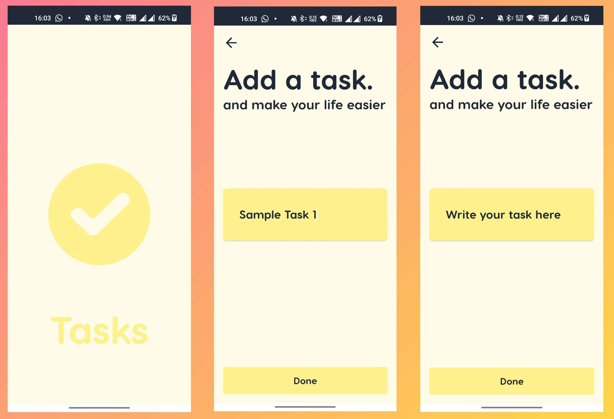

# Tasks

A To-Do List mobile application to list down your tasks.
---

## Screenshots

## Motive
The application exhibits local database system CRUD (Create, Read, Update, Delete) operations. Data is kept locally in the contrivance storage utilizing Sqlite. When the app is launched again, the utilizer can integrate tasks, close the app, clear the background, and still optically discern their task list.

## Techstack Used
- Java
- XML
- Android

## Steps to run the app
1. Utilize Android Studio to clone the repository on your local system (git clone/download zip file).
2. Launch your emulator or connect with your own smartphone.
3. Start the app.
